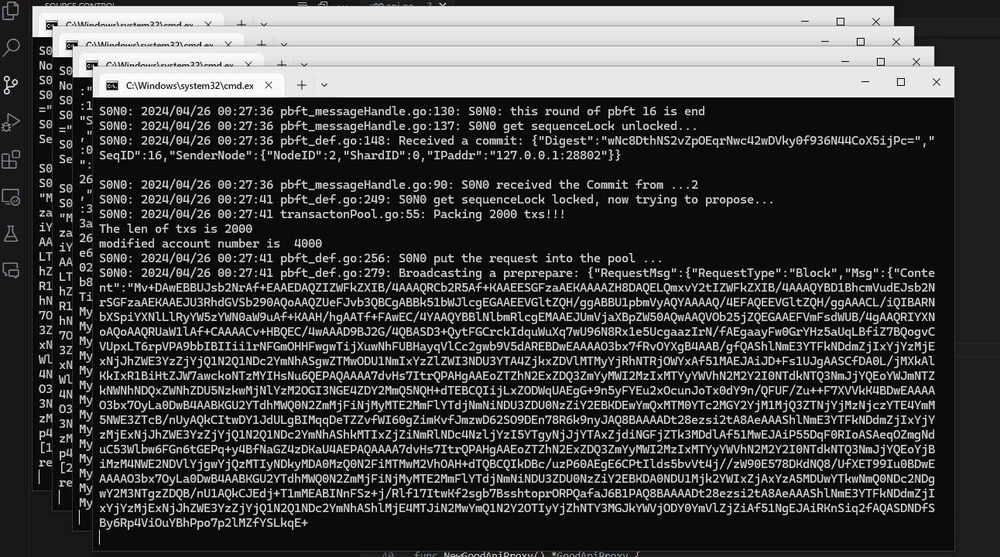

# BlockchainEmulator

## 关于项目

区块链模拟器可以模拟 PBFT 协议的区块链运行，并且测量数据。

该项目旨在:
* 模拟 PBFT 协议的区块链运行
* 提供运行时交易池数据测量以及其他数据测量
* 可使用的前端

项目具有可使用的前端：


项目启动时将启动若干节点，每个节点对应一个命令行窗口：



项目运行完成后，将生成统计报表。统计报表包括 PBFT 交易池统计量：


同时，统计报表也包括一些别的系统度量：


## 构建工具

用以下工具来 bootstrap 此项目

* Go 1.21 以上版本


## 快速开始

为了快速得到本地拷贝并快速运行，这是快速开始章节。

### 前置条件

- 安装 Go 1.21
- 安装 Powershell 7.1


### 获取

1. 克隆仓库
```sh
git clone https://github.com/Aj002Th/BlockchainEmulator.git
```


### 使用运行

最简单的例子是批量启动。目前仅适用于 Windows Powershell。

```sh
./run.ps1 -N 3
```

_更具体的例子，请参看 [使用手册](./docs/使用手册.md)_


## 获取前端源码

为了克隆前端源码你应当在克隆时就递归克隆子模块。

```
git clone https://github.com/Aj002Th/BlockchainEmulator.git --recurse-submodules
```

或者，如果已经克隆了前端但没有安装子模块，那么你可以安装子模块。

```
git submodule init 
git submodule update
```