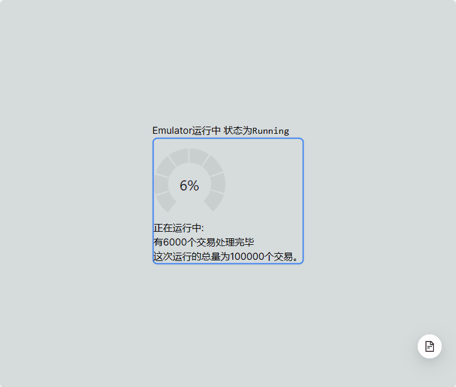

# BlockchainEmulator

<!-- ABOUT THE PROJECT -->
## 关于项目

[![Product Name Screen Shot][product-screenshot]](https://example.com)

区块链模拟器可以模拟PBFT协议的区块链运行，并且测量数据。

该项目旨在:
* 模拟PBFT协议的区块链运行
* 提供运行时交易池数据测量以及其他数据测量
* 可使用的前端

项目具有可使用的前端：



项目启动时将启动若干节点，每个节点对应一个命令行窗口：


<p align="right">(<a href="#readme-top">back to top</a>)</p>


### 构建工具

用以下工具来bootstrap此项目

* Go 1.22以上版本

<p align="right">(<a href="#readme-top">back to top</a>)</p>


<!-- GETTING STARTED -->
## 快速开始

为了快速得到本地拷贝并快速运行，这是快速开始章节。

### 前置条件

安装Go 1.22

### 安装
<!-- 
_Below is an example of how you can instruct your audience on installing and setting up your app. This template doesn't rely on any external dependencies or services._

1. Get a free API Key at [https://example.com](https://example.com)
2. Clone the repo
   ```sh
   git clone https://github.com/your_username_/Project-Name.git
   ```
3. Install NPM packages
   ```sh
   npm install
   ```
4. Enter your API in `config.js`
   ```js
   const API_KEY = 'ENTER YOUR API';
   ``` -->

1. 克隆仓库
```sh
git clone https://github.com/Aj002Th/BlockchainEmulator.git
```


<p align="right">(<a href="#readme-top">back to top</a>)</p>


<!-- USAGE EXAMPLES -->
## 使用用例

用go启动器运行。最简单的例子是批量启动。目前仅适用于Windows。

```
./run.ps1 -N 3
```

Linux也可以，需要gnome-terminal或其他终端模拟器支持（自行修改启动文件）。
注意：脚本未经测试。

```
./run.sh
```

_更具体的例子，请参看 [文档](./docs/README.md)_


## 克隆前端源码

为了克隆前端源码你应当在克隆时就递归克隆子模块。

```
git clone https://github.com/Aj002Th/BlockchainEmulator.git --recurse-submodules
```

或者，如果已经克隆了前端但没有安装子模块，那么你可以安装子模块。

```
git submodule init 
git submodule update
```