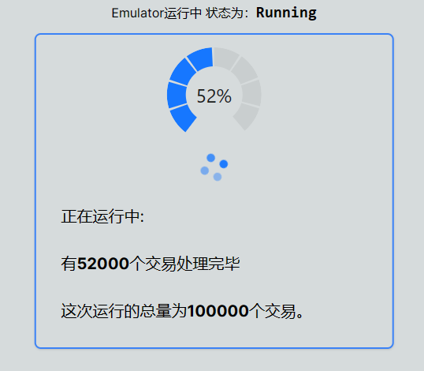
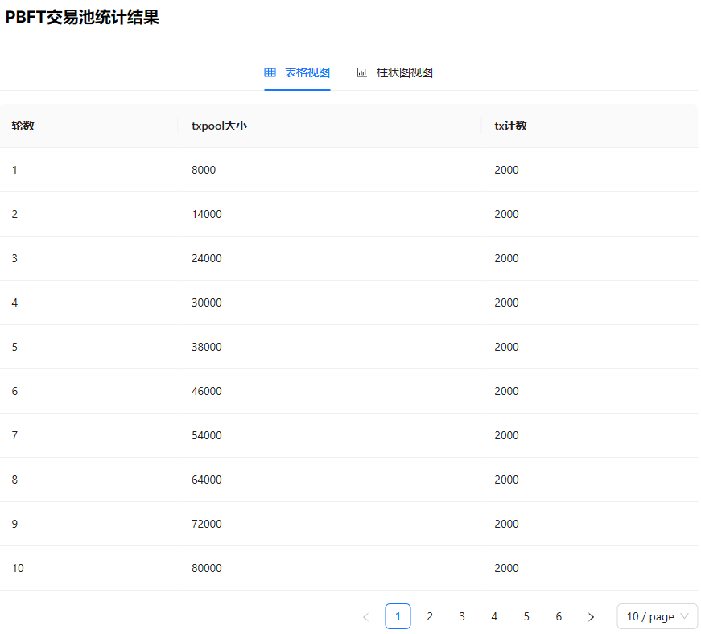
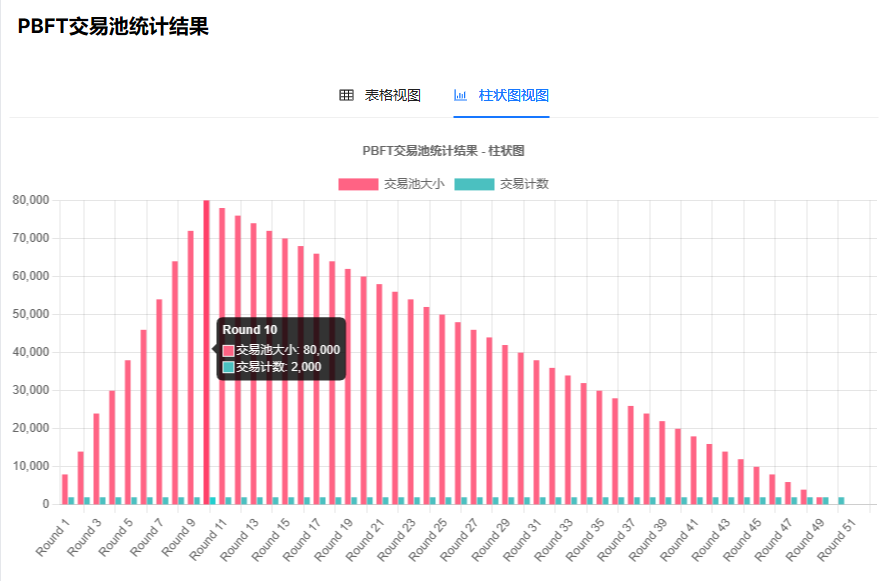
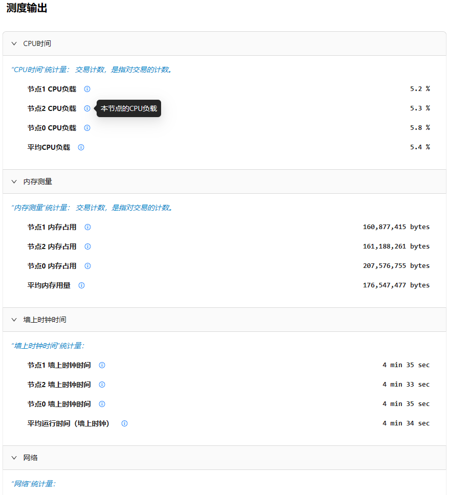

# 使用手册

## 前置条件
- powershell 7.1
- go 1.21

## 启动流程

为了启动Blockchain Emulator，需要指定编译选项、编译，最后将二进制文件分发后运行。

为了便利起见，也可以在本地通过脚本批量运行。

注意：

需要先准备好以太坊数据。在用户未显式指定路径的情况下，程序默认放置的路径为`./BlockTransaction.csv`。
可以通过`-FileInput`命令行选项显示指定路径。

```sh
./run.ps1 -FileInput your_input_file_path
```

### 编译选项配置

在 params/user_constant.go 中修改注入速度等参数，方便后续进行分发。

user_constant的详细说明参见下文[功能说明部分](#功能说明)

### 编译

在主目录下执行编译指令

```sh
./build.ps1
```

### 分发并运行

在本机运行时，可以直接使用`run.ps1`启动脚本进行方便的启动。

```sh
./run.ps1 # 默认的配置，在本机上启动三个节点

./run.ps1 -N 4 # 自定义节点数目，在本机上启动四个节点
```

## 功能说明

<!-- 展示前端功能和操作方法 -->

前端运行完毕后，系统将本次运行中收集的度量以表格、图表形式输出。



上图展示了运行时前端展示状态。此时前端提示节点中PBFT共识节点对交易的共识完成情况。





上图展示了PBFT交易池统计结果的表格视图。"txpool大小"列说明的是运行过程中n轮处理后交易池的大小；"tx计数"则表明了本轮处理中所处理的交易计数。




上图展示了PBFT交易池统计结果的柱状图视图。红色柱形代表"txpool大小"列值的大小；绿色柱形代表"tx计数"列值的大小。



上图展示了测度输出的一部分。测度输出是分组的一系列值。每组输出都有对应的描述，每个测度值也有各自的描述，并且列出了各自的单位。


## 高级配置

使用脚本可以很方便地启动系统，脚本支持的的配置和含义如下：


| 长参数        | 短参数 | 含义          |
|------------|-----|-------------|
| -NodeNum   | -N  | PBFT共识节点数目  |
| -FileInput | -i  | 输入交易数据文件的路径 |


你也可以自行使用二进制文件手动启动相应的节点，以支持更加丰富的特性。
可通过命令参数修改的系统配置如下:

```go
// 系统的默认配置
var (
	BlockInterval      = 5000  // generate new block interval
	MaxBlockSizeGlobal = 2000  // the block contains the maximum number of transactions
	InjectSpeed        = 2000  // the transaction inject speed
	TotalDataSize      = 16000 // the total number of txs
	BatchSize          = 16000 // supervisor read a batch of txs then send them, it should be larger than inject speed
	NodeNum            = 3
	LogWritePath       = "./log"                  // log output path
	DataWritePath      = "./result"               // measurement data result output path
	RecordWritePath    = "./record"               // record output path
	SupervisorEndpoint = "127.0.0.1:18800"        //supervisor ip address
	FileInput          = `./BlockTransaction.csv` //the raw BlockTransaction data path
)
```

例如要将带有前端的 Superviosr 节点的 BlockInterval 参数修改为 1000，我们可以在启动节点时使用如下的命令
```sh
./BlockchainEmulator.exe -c -f -BlockInterval 1000
```

