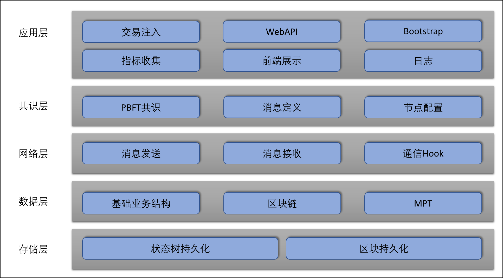

# 系统架构

整体而言，系统的大致思路是先搭建一个完整的区块链平台，在在此基础上加入的监控系统进行指标的收集，用于测试和验证区块链协议。

## 使用的技术栈
- 服务端: Go
- 前端：Next.js

## 目录结构
- **application**
  - **supervisor**: 监测器节点，负责交易注入、指标统计和收集、前端服务、协调系统等
- **bcEmSupMonitor**
  - **app**: 包含仪表板、监视器和报告功能。
  - **common**: 公共实用工具。
  - **components**: 包含em-status组件。
  - **docs**: 文档。
  - **mock_server**: 用于测试的模拟服务器。
  - **public**: 公共资源。
  - **store**: 存储相关功能。
- **boot**: 启动相关功能。
- **consensus**
  - **pbft**: 与 Practical Byzantine Fault Tolerance 共识机制相关的包，包括 meter 用于上报全局指标给 supervisor。
- **data**
  - **base**: 区块链基础数据结构。
  - **chain**: 区块链数据结构的实现。
  - **mpt**: Merkle Patricia Trie 数据结构实现。
- **docs**: 项目文档。
- **logger**: 日志功能。
- **misc**: 杂项实用工具。
- **network**: 网络相关功能。
- **params**: 全局配置参数。
- **signal**：信号模块。
- **storage**
  - **blockStorage**: 区块持久化存储。
  - **stateStorage**: 状态持久化存储。
- **web**
  - **out**: 前端构建产物。
- **result**: 测量指标输出目录。
- **log**: 日志文件输出目录。
- **record**: 区块链持久化文件的存储目录。

## 分层设计

### 具体分层

这个系统可以分为以下几个层：

1. **应用层**：该层主要负责系统整体运行，对外提供用户功能。
2. **共识层**：该层主要包含共识协议的定义和运行。
3. **网络层**：该层主要负责为上层提供点对点网络通信能力。
4. **数据层**：该层主要负责区块链相关基本数据结构的具体定义以及实现相关的数据操作方法。
5. **存储层**：该层主要负责数据的持久化存储。

### 每层的实现思路和不同层次的能力

每个层次的实现思路和能力会因功能不同而异。这里提供了每个层次的一般思路和能力：

1. **应用层**：
   - **实现思路**：划分为 Supervisor 节点、PBFT 共识节点与前端三个部分。通过 Socket、Websocket 等协议实现相互之间的通信。前端相关模块包括 Web API 和其他 Web 相关的功能，用于与外部系统或用户进行交互。
   - **能力**：实现了交易注入、指标统计和收集、前端服务、系统协调、用户接口（UI）等功能。提供网络接口，支持外部系统或用户通过 Websocket 或其他协议进行数据交换和访问，实现系统的开放性和可扩展性。

2. **共识层**：
   - **实现思路**：按照 PBFT 论文实现 PBFT 共识算法。确保区块链模拟器网络中各共识节点对已认可交易的一致性。
   - **能力**：提供节点间的共识协商能力，确保网络中的所有节点就交易达成共识，保证网络的一致性和安全性。

3. **网络层**：
   - **实现思路**：通过接口定义能力，让具体实现和抽象能力之间解耦。默认提供直接基于 TCP 实现的自定义协议实现。自定义协议使用TLV协议（BER编码的一种，全称是Tag、length、value）设计思路实现。
   - **能力**：处理节点间的网络通信，确保节点之间可以进行有效的信息传递和交互。能实现节点间的单点通信、广播通信，并且兼容多种通信协议，为系统提供更多的扩展性。

4. **数据层**：
   - **实现思路**：基于区块链相关知识，实现了区块、交易、交易池、区块链、MPT 树等底层数据结构。
   - **能力**：提供数据的持久化存储、高效的数据访问能力，并保证数据的一致性和完整性。
位于数据目录（data）下，包括基础数据、链上数据和 Merkle Patricia Trie等。这些层负责管理系统所需的数据，并提供数据访问的接口。

5. **存储层**：
   - **实现思路**：基于 KV 存储引擎，实现了一套针对数据层中相关结构的持久化方案。方法是利用 hash 作为 k，对应需要存储的区块、状态树节点等数据结构序列化后作为 value 后再交由 KV 存储引擎进行数据落盘。
   - **能力**：负责处理区块和状态的存储，保证系统数据的持久性和可靠性。提供数据的持久化存储、高效的数据访问能力，并保证数据的一致性和完整性。
